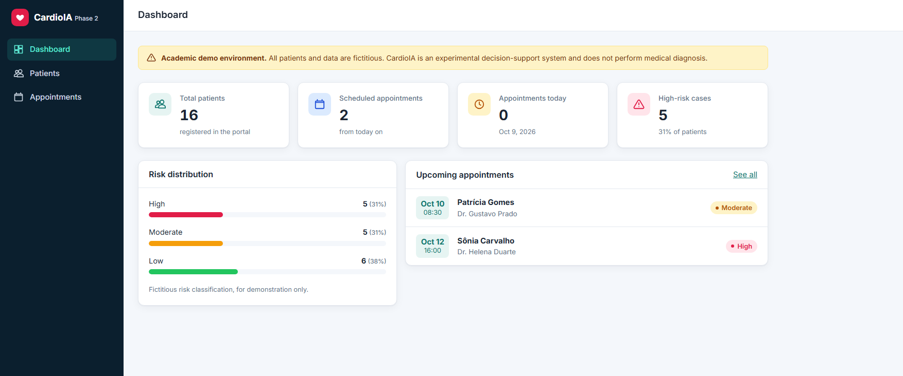

# FIAP - Faculdade de Informática e Administração Paulista

<p align="center">
<a href= "https://www.fiap.com.br/"></a>
</p>

<br>

# CardioIA


## Member:
- Vinicius Salvador

## Professors:
### Tutor
- Leonardo Ruiz Orabona
### Coordinator
- André Godoi

## Description

**CardioIA** is the academic project of FIAP's AI course (PBL methodology) that progressively builds a digital platform simulating a modern cardiology practice. It combines clinical data, Natural Language Processing, Machine Learning, deep learning and a web portal to support triage, diagnosis and patient follow-up.

## What is in the project

### Datasets

- **Numeric patient data:** 920 patients from the 4 databases of the [UCI Heart Disease Data Set](https://archive.ics.uci.edu/dataset/45/heart+disease) (Cleveland, Hungary, Switzerland and Long Beach), combined into `data/processed/cardioai_numeric_dataset.csv` (age, sex, chest pain type, blood pressure, cholesterol, max heart rate, exercise-induced angina, ST depression and diagnosis). The most clinically relevant variables are the classic risk factors (age, sex, blood pressure, cholesterol), the ischemia symptoms (chest pain type, exercise-induced angina) and the stress-test results (max heart rate, ST depression). An exploratory analysis is in `notebooks/eda_numeric_dataset.ipynb`.
- **Medical texts:** William Harvey's *Motion of the Heart* (1628, Project Gutenberg) and the ERICO study editorial on coronary disease in Brazil (Arq. Bras. Cardiol., 2021, via PubMed Central), in `data/text/`.
- **Chest X-rays:** 150 images (PA/AP views) from the [COVID-19 Image Data Collection](https://github.com/ieee8023/covid-chestxray-dataset), with metadata (finding, sex, age, license) in `data/images/images_metadata.csv`. The images themselves are in the [shared folder](https://drive.google.com/drive/folders/1Rnyb5qoJ4UAI7IpOl44qkLuWHbx4s8Bs?usp=sharing).
- **ECG heartbeats:** [ECG Heartbeat Categorization](https://www.kaggle.com/datasets/shayanfazeli/heartbeat) (MIT-BIH and PTB), downloaded by script into `data/raw/ecg/` (~580 MB, not versioned).
- **Simulated NLP data:** 10 patient reports, a 43-row symptom → condition knowledge map, a table of symptom spelling variants and 121 sentences labeled `low risk` / `high risk`, all in `data/text/`.

### Symptom extraction (NLP)

`src/nlp/symptom_extraction.py` reads the patient reports, normalizes the text (lowercase, no accents or punctuation, simple plural handling), finds the symptoms of the knowledge map and their variants as word sequences, and ranks the most likely conditions by the number of matching symptoms. It is rule-based, with no external library or LLM. In the 10 reports it found 2 to 4 symptoms each and gave at least one suggestion for all of them (output in `results/nlp/extraction_results.csv`). It does not handle negation and only recognizes the registered expressions.

### Risk classifier (TF-IDF + Logistic Regression)

`notebooks/risk_classifier.ipynb` turns each sentence into a TF-IDF vector (unigrams + bigrams) and trains a Logistic Regression to predict whether a patient's description is **low risk** or **high risk**. With a stratified 80/20 split it reached **0.920 accuracy** and **1.000 recall for high risk** on the test set, and **0.867 mean accuracy** in 5-fold cross-validation. The notebook also tests new sentences, analyzes the decision threshold and shows the model's bias: it learns writing patterns (its strongest high-risk word is "and"), not medicine. `src/nlp/risk_classifier.py` runs the same pipeline from the terminal.

### ECG heartbeat classifier (Keras MLP)

`notebooks/ecg_mlp_classifier.ipynb` classifies single ECG heartbeats, each represented by 187 signal values (the dataset has signals, not images). Two MLP neural networks are trained (`Dense 128 → 64 → Dropout → 32`, with normalization, class weights and early stopping):

| Model | Predicts | Accuracy | F1 |
|---|---|---|---|
| PTB | whether a heartbeat is **normal or abnormal** (sigmoid output) | 0.9615 | 0.9733 |
| MIT-BIH | the **heartbeat type**: normal, supraventricular, ventricular, fusion or unknown (softmax output) | 0.9728 | 0.865 (macro) |

Charts and metrics are saved in `results/ecg/`. The PTB model shows mild overfitting (99.2% train vs 96.2% test accuracy), and in MIT-BIH the rare classes are harder (22% of supraventricular beats are classified as normal).

### Web portal (React)

`apps/portal/` is a React + Vite app with a simulated login (fake JWT in `localStorage`) and protected routes, a dashboard (total patients, scheduled appointments, appointments today, high-risk cases), a patient table with search and risk filter, and an appointment form with validation. It uses Context API, `useState`, `useEffect`, `useContext` and `useReducer`, a fake API backed by local JSON, CSS Modules and a responsive layout.

<p align="center">

</p>

## Folder structure

```
cardioai/
├── data/
│   ├── raw/              # original sources (UCI heart-disease files; ECG CSVs, not versioned)
│   ├── processed/        # combined numeric dataset
│   ├── text/             # medical texts and NLP datasets
│   └── images/           # chest X-ray sample + metadata
├── src/
│   ├── data_collection/  # scripts that download/build the datasets
│   └── nlp/              # symptom extraction and risk classifier
├── notebooks/            # EDA, risk classifier and ECG classifier
├── apps/portal/          # React + Vite portal
├── results/              # generated outputs (nlp/, ecg/)
├── assets/               # FIAP logo and portal screenshot
├── pyproject.toml        # Python dependencies (uv)
└── uv.lock
```

## How to run

Requirements: Python 3.13+, [uv](https://docs.astral.sh/uv/) and, for the portal, Node.js 18+. Run everything from the repository root.

```bash
uv sync                                                  # installs the Python environment

uv run python src/data_collection/build_dataset.py       # builds the numeric dataset from the UCI files
uv run python src/data_collection/download_images.py     # downloads the chest X-ray sample
uv run python src/data_collection/download_ecg.py        # downloads the ECG dataset

uv run python src/nlp/symptom_extraction.py              # symptom extraction (--csv saves results/nlp/)
uv run python src/nlp/risk_classifier.py                 # risk classifier (--sentence "..." to test a sentence)
uv run jupyter notebook                                  # opens the notebooks (saved already executed)

cd apps/portal && npm install && npm run dev             # portal at http://localhost:5173
```

If the ECG download fails with a credentials error, an invalid `~/.kaggle/kaggle.json` is usually the cause: fix it with a valid Kaggle token or download the dataset manually into `data/raw/ecg/`.

## Ethics, governance and limitations

- **Simulated or public data only.** The NLP reports, labeled sentences and portal patients were written for teaching purposes; no real patient data is collected.
- **No clinical validation.** High metrics on academic datasets do not mean clinical performance, and any real use would need medical supervision and regulatory approval.
- **Bias.** The UCI data mixes 4 institutions with very different disease prevalence (from about 36% in Hungary to 93% in Switzerland) and has missing values; the X-ray sample is ~75% COVID-19/viral pneumonia; the ECG data comes from few patients and is split by heartbeat, not by patient (optimistic results); the risk classifier learns writing patterns from a small, non-diverse set of sentences.
- **Errors matter.** False negatives (a severe case treated as mild) are the most dangerous error, which is why the high-risk recall is analyzed; false positives cause unnecessary alarms.
- **Privacy.** Health data is sensitive personal data under Brazil's LGPD; the portal's authentication is simulated and offers no real security.

## Data sources and licenses

- UCI Heart Disease — Janosi, A., Steinbrunn, W., Pfisterer, M., & Detrano, R. (1989), CC BY 4.0. https://doi.org/10.24432/C52P4X
- Harvey, W. *An Anatomical Disquisition on the Motion of the Heart & Blood in Animals* — Project Gutenberg, public domain. https://www.gutenberg.org/ebooks/67065
- Marinho, F. (2021). ERICO study editorial, *Arquivos Brasileiros de Cardiologia* 117(5) — CC BY. https://pmc.ncbi.nlm.nih.gov/articles/PMC8682102/
- Cohen, J. P., Morrison, P., & Dao, L. (2020). COVID-19 Image Data Collection — per-image licenses (mostly CC BY-NC-SA / CC BY-NC-ND), listed in the metadata CSV. https://arxiv.org/abs/2003.11597
- Kachuee, M., Fazeli, S., & Sarrafzadeh, M. (2018). ECG Heartbeat Categorization, derived from the MIT-BIH Arrhythmia and PTB Diagnostic ECG databases (PhysioNet) — not redistributed here.

## License

<p xmlns:cc="http://creativecommons.org/ns#" xmlns:dct="http://purl.org/dc/terms/"><a property="dct:title" rel="cc:attributionURL" href="https://github.com/agodoi/template">FIAP GIT MODEL</a> by <a rel="cc:attributionURL dct:creator" property="cc:attributionName" href="https://fiap.com.br">Fiap</a> is licensed under <a href="http://creativecommons.org/licenses/by/4.0/?ref=chooser-v1" target="_blank" rel="license noopener noreferrer" style="display:inline-block;">Attribution 4.0 International</a>.</p>
